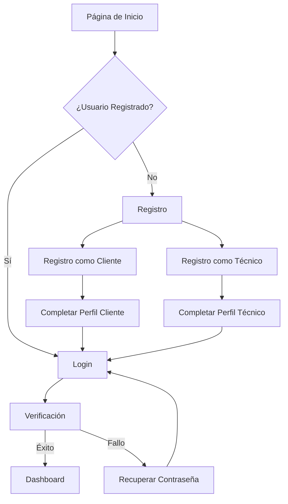
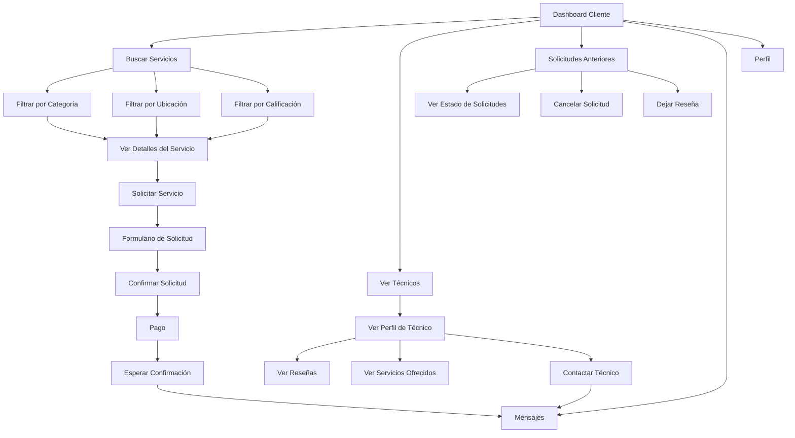
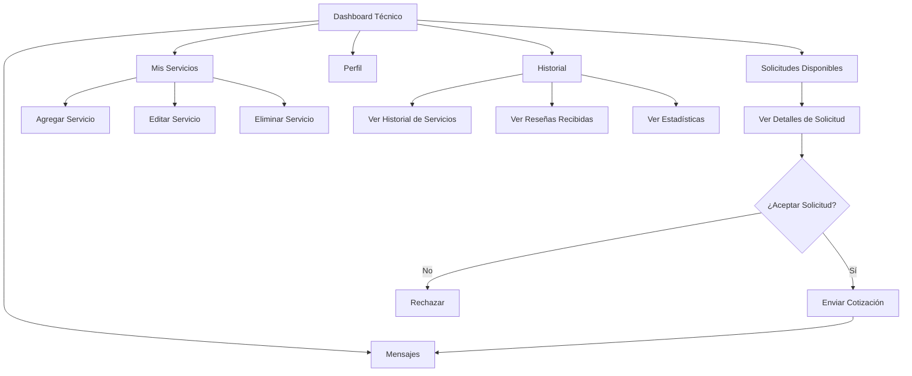
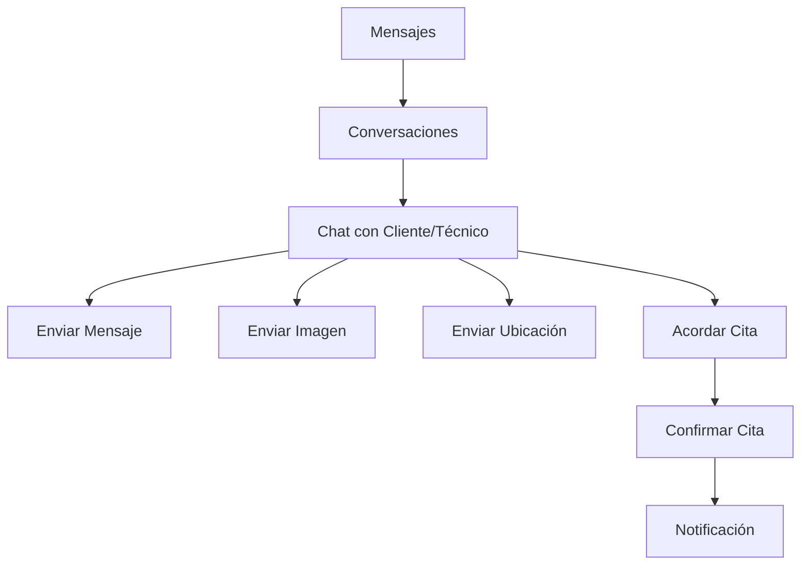
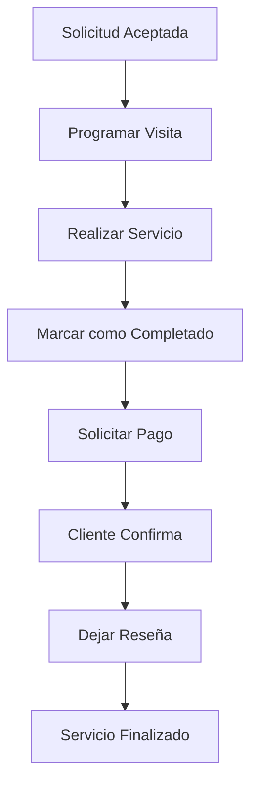

# Mapa de Flujo de la Aplicación de Servicios ManitasRd1

## Descripción General
Este diagrama representa el flujo de usuario para una aplicación de servicios técnicos que conecta a clientes con técnicos profesionales.

## Flujos Principales

### 1. Flujo de Registro y Autenticación

### 2. Flujo de Cliente

### 3. Flujo de Técnico

### 4. Flujo de Comunicación

### 5. Flujo de Servicio

## Puntos de Entrada

- Registro directo
- Login
- Búsqueda de servicios
- Notificaciones
- Enlaces de referencia

## Puntos de Decisión Clave

1. Tipo de usuario (Cliente/Técnico)
2. Aceptación/Rechazo de solicitudes
3. Confirmación de pagos
4. Finalización de servicios

## Consideraciones de Diseño

- Minimizar pasos para completar tareas principales
- Proporcionar retroalimentación clara en cada etapa
- Diseñar para dispositivos móviles primero
- Implementar notificaciones para mantener a los usuarios informados
- Asegurar que los flujos de pago sean seguros y transparentes
- Facilitar la comunicación entre clientes y técnicos
- Incorporar sistema de reseñas para construir confianza